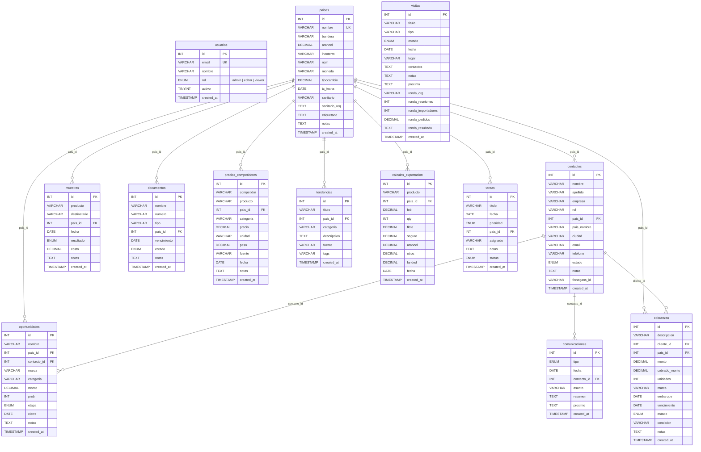

# TradeCRM — Comercio Exterior Don Yeyo S.A.

TradeCRM es una herramienta de gestión de relaciones con clientes (CRM) y control de operaciones de Comercio Exterior diseñada específicamente para Don Yeyo S.A.

Este proyecto hereda la arquitectura robusta y la estética premium (incluyendo soporte nativo para Modo Oscuro/Claro y Autenticación con Microsoft Azure AD) del sistema `dy_control_ingresos_egresos`.

---

## 🛠️ Estructura del Proyecto (Monorepo)

```
dy_comex/
├── client/                 # Frontend React + Vite + CSS Vanilla
│   ├── src/
│   │   ├── main.jsx        # Punto de entrada de React
│   │   ├── App.jsx         # Vistas interactivas de CRM
│   │   ├── App.css         # Estética Premium (Modo Oscuro/Claro)
│   │   └── authConfig.js   # Configuración de MSAL Azure AD
│   └── package.json
├── server/                 # Backend Node.js + Express
│   ├── config/db.js        # Conexión a MySQL
│   ├── middleware/auth.js  # Autenticación Microsoft AD Token Validator
│   ├── controllers/        # Controladores de la API
│   ├── routes/             # Enrutador de llamadas de API
│   ├── services/
│   │   └── finnegansService.js # Integración con Finnegans ERP
│   └── package.json
├── schema.sql              # Estructura del modelo de datos de MySQL
├── Dockerfile              # Dockerfile multi-stage
├── docker-compose.yml      # Configuración de servicios Docker local
├── netlify.toml            # Configuración para despliegue Serverless en Netlify
└── package.json            # Scripts del Monorepo
```

---

## 🔒 Configuración de Autenticación con Microsoft (Azure AD)

Para que el login corporativo funcione con cuentas `@donyeyo.com.ar`, se debe registrar la aplicación en el portal de Azure:

1. Ve a **Microsoft Entra ID (Azure Active Directory)** > **App registrations** > **New registration**.
2. Completa los detalles:
   - **Name**: `TradeCRM - Comercio Exterior`
   - **Supported account types**: `Accounts in this organizational directory only` (Single tenant) o `Multitenant`.
   - **Redirect URI**: Selecciona `Single-page application (SPA)` y coloca `http://localhost:3000` (desarrollo local) y la URL de tu Netlify en producción.
3. En la sección **Authentication**:
   - Asegúrate de habilitar **Access tokens** e **ID tokens** (Implicit grant flow si utilizas flujos simplificados, aunque MSAL Browser v3 prefiere Proof Key for Code Exchange (PKCE)).
4. En **API permissions**:
   - Otorga el permiso `User.Read` (Microsoft Graph) para poder leer los datos básicos del usuario logueado.
5. Copia el **Application (client) ID** y el **Directory (tenant) ID** e introdúcelos en tu archivo `.env`.

---

## 🚀 Instalación y Ejecución Local

### Prerrequisitos
- Node.js (v20 o superior)
- Docker Desktop (para la base de datos MySQL local)

### Paso 1: Configurar Variables de Entorno
Debes configurar los archivos `.env` en cada subproyecto de forma independiente:

- **En el Servidor (`/server`):**
  Copia el template e introduce las configuraciones de tu base de datos y Microsoft Azure:
  ```bash
  cd server
  cp .env.template .env
  ```
- **En el Cliente (`/client`):**
  Copia el template y define el Client ID y Tenant ID de Azure:
  ```bash
  cd client
  cp .env.template .env
  ```

### Paso 2: Levantar Base de Datos MySQL
Si ya tienes la instancia Docker de MySQL configurada mediante el `docker-compose.yml` en la raíz de `Proyectos`, puedes importar el esquema ejecutando:
```bash
mysql -u root -p -h localhost < schema.sql
```

### Paso 3: Instalar dependencias e iniciar los servicios de forma individual
Puedes levantar cada entorno por separado abriendo dos terminales:

* **Iniciar el Servidor (Backend):**
  ```bash
  cd server
  npm install
  npm run dev
  ```
  El backend estará disponible en `http://localhost:5000`.

* **Iniciar el Cliente (Frontend):**
  ```bash
  cd client
  npm install
  npm run dev
  ```
  El frontend estará disponible en `http://localhost:3000`.

---

## 🐳 Despliegue con Docker
Para construir y levantar toda la arquitectura de manera contenerizada:
```bash
docker-compose up --build
```

---

## 📋 Módulos del CRM

| Módulo | Descripción |
|---|---|
| **Dashboard** | Métricas clave, funnel de oportunidades, alertas, volumen de exportación, actividad reciente. |
| **Tareas** | Gestión de tareas con prioridad, fecha límite, asignación y seguimiento de estado (pendiente/hecha). |
| **Alertas** | Alertas automáticas generadas por documentos próximos a vencer y visitas planificadas. |
| **Contactos** | ABM completo de contactos (importadores, distribuidores, brokers). Sincronización con Finnegans ERP. |
| **Visitas** | Registro de ferias, rondas de negocios, reuniones comerciales con datos específicos por tipo. |
| **Oportunidades** | Pipeline de ventas con etapas (Prospecto → Cerrado), montos, probabilidad y cierre estimado. |
| **Muestras** | Seguimiento de envío de muestras, resultado (positivo/negativo), costo y feedback del cliente. |
| **Comunicaciones** | Log de comunicaciones (email, llamada, WhatsApp, reunión, videollamada) con línea de tiempo. |
| **Países** | Ficha completa de cada país destino: arancel, incoterm, organismo sanitario, requisitos de etiquetado. |
| **Documentos** | Control de documentos de exportación con alertas de vencimiento (Invoice, B/L, certificados). |
| **Inteligencia de mercado** | Precios de competidores con cálculo automático de precio/kg. Notas de tendencias con etiquetas. |
| **Calculadora** | Cálculo de costo landed (FOB + flete + seguro + arancel + gastos en destino). Guardado de simulaciones. |
| **Cobranzas** | Gestión de cobranzas con totales cobrados, pendientes y vencidos. Cálculo de saldo automático. |

---

## 📐 Diagrama Entidad-Relación (DER)

El modelo de datos está compuesto por 14 tablas con relaciones de clave foránea centradas en la tabla `paises` y `contactos`.



### Relaciones principales

| Tabla origen | Tabla destino | FK | Tipo |
|---|---|---|---|
| `paises` | `contactos`, `oportunidades`, `muestras`, `documentos`, `precios_competidores`, `tendencias`, `calculos_exportacion`, `cobranzas`, `tareas` | `pais_id` | 1:N |
| `contactos` | `oportunidades` | `contacto_id` | 1:N |
| `contactos` | `comunicaciones` | `contacto_id` | 1:N |
| `contactos` | `cobranzas` | `cliente_id` | 1:N |

---

## 🔎 Zoom de interfaz configurable

La aplicación incluye un selector de tamaño de texto y controles con 3 niveles:

| Nivel | Descripción |
|---|---|
| **A** (chico) | Texto e inputs más compactos, ideal para ver más información en pantalla. |
| **A** (mediano) | Tamaño estándar, configuración por defecto. |
| **A** (grande) | Texto e inputs más grandes, ideal para mejor legibilidad. |

El selector se encuentra en la barra superior (header) junto al botón de modo oscuro/claro. La configuración se guarda automáticamente en el `localStorage` del navegador y persiste entre sesiones.

---

## 📖 Manual de usuario

Para una guía completa de cada pantalla del sistema, consultá el **[Manual de Usuario](docs/MANUAL_USUARIO.md)**.

El manual incluye:
- Descripción de cada módulo y sus funciones.
- Campos de formularios con reglas de validación.
- Consejos de uso para aprovechar al máximo el sistema.
